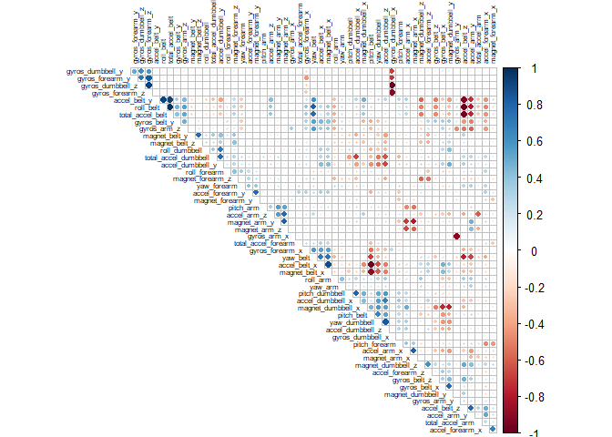
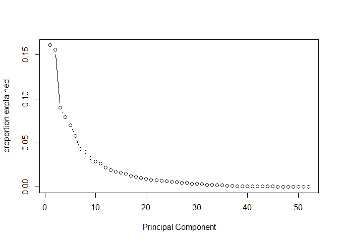
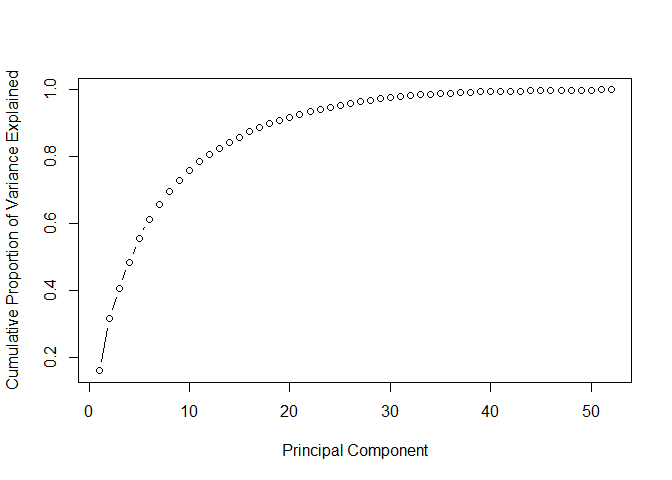

```r
library(caret)
```

```
## Warning: package 'caret' was built under R version 3.4.4
```

```
## Warning: package 'ggplot2' was built under R version 3.4.4
```

```r
library(plyr)
```

```
## Warning: package 'plyr' was built under R version 3.4.4
```

```r
library(dplyr)
```

```
## Warning: package 'dplyr' was built under R version 3.4.4
```

```r
library(randomForest)
```

```
## Warning: package 'randomForest' was built under R version 3.4.4
```

```r
library(ranger)
```

```
## Warning: package 'ranger' was built under R version 3.4.4
```

```r
library(corrplot)
```

```
## Warning: package 'corrplot' was built under R version 3.4.4
```


### Data Load 

Loading the necessary data 


```r
setwd("C:/Personal/Raj")

load("Assignment.RData")

TrainingSet <- read.csv("C:/Personal/Raj/pml-training.csv" , colClasses = c("character"))

TestingSet <- read.csv("C:/Personal/Raj/pml-testing.csv" , colClasses = c("character"))
```


### Data Clean Up 


## Remove the unnecessary Columns from both Training and Test data


```r
TrainingSet <- TrainingSet[ ,-c(1:7)]


TestingSet <- TestingSet[ ,-c(1:7)]


TrainingOutput <- TrainingSet[ , 153]


TrainingSet <- TrainingSet %>% select(-classe)


TestingSet <- TestingSet %>% select(-problem_id)
```

### Conversion


## Variables are converted to Numeric Format 


```r
TrainingSet <- sapply(TrainingSet , as.numeric)
```

```
## Warning in lapply(X = X, FUN = FUN, ...): NAs introduced by coercion

## Warning in lapply(X = X, FUN = FUN, ...): NAs introduced by coercion

## Warning in lapply(X = X, FUN = FUN, ...): NAs introduced by coercion

## Warning in lapply(X = X, FUN = FUN, ...): NAs introduced by coercion

## Warning in lapply(X = X, FUN = FUN, ...): NAs introduced by coercion

## Warning in lapply(X = X, FUN = FUN, ...): NAs introduced by coercion

## Warning in lapply(X = X, FUN = FUN, ...): NAs introduced by coercion

## Warning in lapply(X = X, FUN = FUN, ...): NAs introduced by coercion

## Warning in lapply(X = X, FUN = FUN, ...): NAs introduced by coercion

## Warning in lapply(X = X, FUN = FUN, ...): NAs introduced by coercion

## Warning in lapply(X = X, FUN = FUN, ...): NAs introduced by coercion

## Warning in lapply(X = X, FUN = FUN, ...): NAs introduced by coercion

## Warning in lapply(X = X, FUN = FUN, ...): NAs introduced by coercion

## Warning in lapply(X = X, FUN = FUN, ...): NAs introduced by coercion

## Warning in lapply(X = X, FUN = FUN, ...): NAs introduced by coercion

## Warning in lapply(X = X, FUN = FUN, ...): NAs introduced by coercion

## Warning in lapply(X = X, FUN = FUN, ...): NAs introduced by coercion

## Warning in lapply(X = X, FUN = FUN, ...): NAs introduced by coercion

## Warning in lapply(X = X, FUN = FUN, ...): NAs introduced by coercion

## Warning in lapply(X = X, FUN = FUN, ...): NAs introduced by coercion

## Warning in lapply(X = X, FUN = FUN, ...): NAs introduced by coercion

## Warning in lapply(X = X, FUN = FUN, ...): NAs introduced by coercion

## Warning in lapply(X = X, FUN = FUN, ...): NAs introduced by coercion

## Warning in lapply(X = X, FUN = FUN, ...): NAs introduced by coercion

## Warning in lapply(X = X, FUN = FUN, ...): NAs introduced by coercion

## Warning in lapply(X = X, FUN = FUN, ...): NAs introduced by coercion

## Warning in lapply(X = X, FUN = FUN, ...): NAs introduced by coercion

## Warning in lapply(X = X, FUN = FUN, ...): NAs introduced by coercion

## Warning in lapply(X = X, FUN = FUN, ...): NAs introduced by coercion

## Warning in lapply(X = X, FUN = FUN, ...): NAs introduced by coercion

## Warning in lapply(X = X, FUN = FUN, ...): NAs introduced by coercion

## Warning in lapply(X = X, FUN = FUN, ...): NAs introduced by coercion

## Warning in lapply(X = X, FUN = FUN, ...): NAs introduced by coercion
```

```r
TestingSet <- sapply(TestingSet , as.numeric)


summary(TrainingSet)
```

### Data Clean Up (Continuation )


 Continuing the data clean up by removing the column which have lots of NAs 


```r
Training_NA <- apply(TrainingSet , 2 , function(x) sum(is.na(x))) 


Training_NA <- as.data.frame(Training_NA)

Training_NA$ColumnNames  <- row.names(Training_NA)


Training_NA <-  Training_NA[which(Training_NA$Training_NA > 0 ) , ]


NA_ColIndex <- which(colnames(TrainingSet) %in% Training_NA$ColumnNames)


TrainingSet <- TrainingSet[ , -NA_ColIndex]

TestingSet <- TestingSet[ , -NA_ColIndex]
```


### Further Analysis 


There were still about 52 Variables. Plotting the correlation among them


```r
CorrData <- cor(TrainingSet)


corrplot(CorrData, type = "upper", tl.pos = "td",
         method = "circle", tl.cex = 0.5, tl.col = 'black',
         order = "hclust", diag = FALSE)
```

<!-- -->


Since there are many variables which are correlated among themselves, we do a PCA 


### Principal Component Analysis 


```r
Training_PR_Comp <- prcomp(TrainingSet , scale. = T)

std_dev <- Training_PR_Comp$sdev


pr_var <- std_dev^2


prop_varex <- pr_var/sum(pr_var)


plot(prop_varex , xlab = "Principal Component" , ylab = "proportion explained" , type = "b")
```

<!-- -->


```r
#cumulative scree plot
plot(cumsum(prop_varex), xlab = "Principal Component",
       ylab = "Cumulative Proportion of Variance Explained",
       type = "b")
```

<!-- -->

About 35 out of the 50 odd Principal Components explain the quantum of variance that is seen. 
Hence retaining only the 35 of the PCs. 


```r
Training.pca <- data.frame(Training_PR_Comp$x)


Training.pca <- Training.pca[ , 1:35]


Testing_PR_Comp <- predict(Training_PR_Comp , TestingSet)

Testing.pca <- as.data.frame(Testing_PR_Comp)


Testing.pca <- Testing.pca[ , 1:35]


Training_withOutput <- cbind(Training.pca , TrainingOutput)
```

### Building the Model 

Building a Random Forest Model using Repeated Cross Validation Technique. 
Using a 5 fold cross validation repeated 3 times. 


```r
control <- trainControl(method="repeatedcv", number=5, repeats=3)

seed <- 7

metric <- "Accuracy"

set.seed(seed)

mtry <- sqrt(ncol(Training_withOutput))

tunegrid <- expand.grid(.mtry=mtry)

rf_default <- train(TrainingOutput~., data=Training_withOutput, method="rf",
                    metric=metric, tuneGrid=tunegrid, trControl=control)
```


### Results of Model 


```r
print(rf_default)
```

```
## Random Forest 
## 
## 19622 samples
##    35 predictor
##     5 classes: 'A', 'B', 'C', 'D', 'E' 
## 
## No pre-processing
## Resampling: Cross-Validated (5 fold, repeated 3 times) 
## Summary of sample sizes: 15698, 15698, 15697, 15698, 15697, 15696, ... 
## Resampling results:
## 
##   Accuracy   Kappa    
##   0.9804984  0.9753224
## 
## Tuning parameter 'mtry' was held constant at a value of 6
```

```r
print(rf_default$finalModel)
```

```
## 
## Call:
##  randomForest(x = x, y = y, mtry = param$mtry) 
##                Type of random forest: classification
##                      Number of trees: 500
## No. of variables tried at each split: 6
## 
##         OOB estimate of  error rate: 1.47%
## Confusion matrix:
##      A    B    C    D    E class.error
## A 5569    6    2    2    1 0.001971326
## B   51 3715   27    0    4 0.021595997
## C    2   23 3378   15    4 0.012857978
## D    5    1  100 3101    9 0.035758706
## E    0   10   16   10 3571 0.009980593
```


The Out of sample or out of bag (OOB) error rate is about 1.5 %. 


### Predicting the Results of Test Dataset 


```r
Predict_Test <- predict(rf_default , Testing.pca)

Predict_Test
```

```
##  [1] B A B A A E D B A A B C B A E E A B B B
## Levels: A B C D E
```

